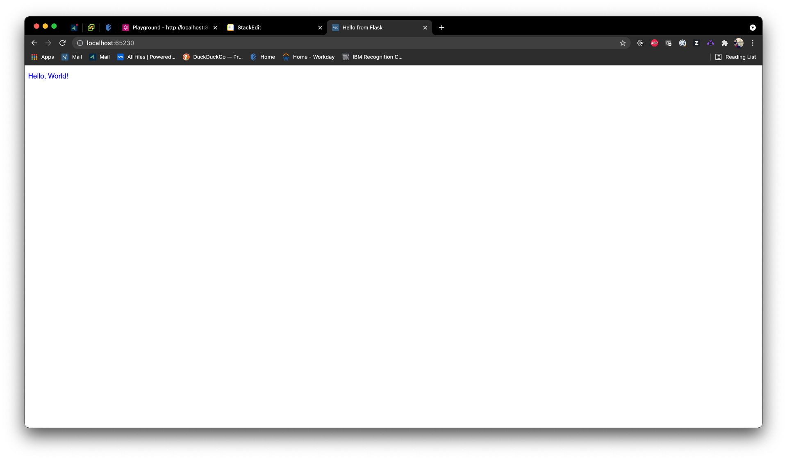
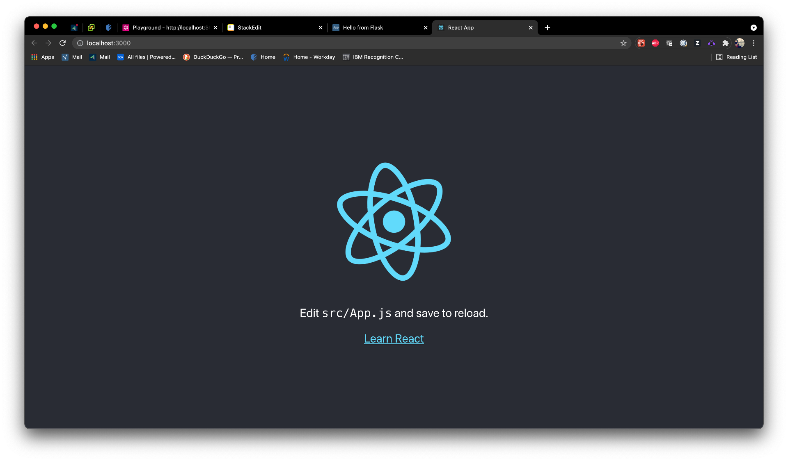
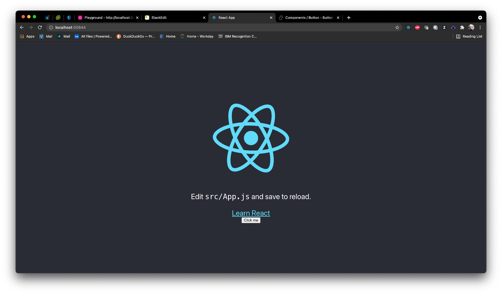
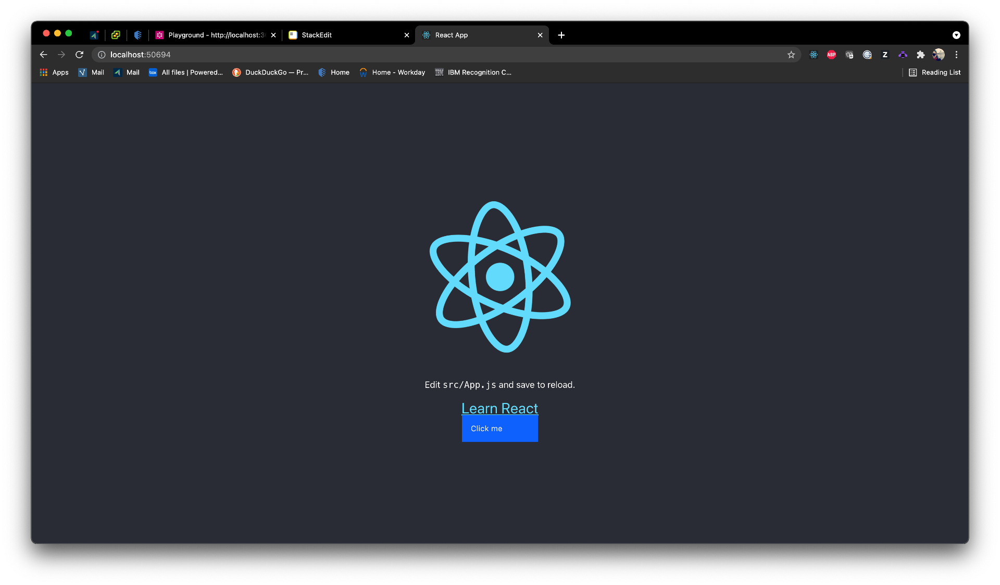
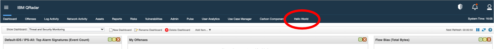
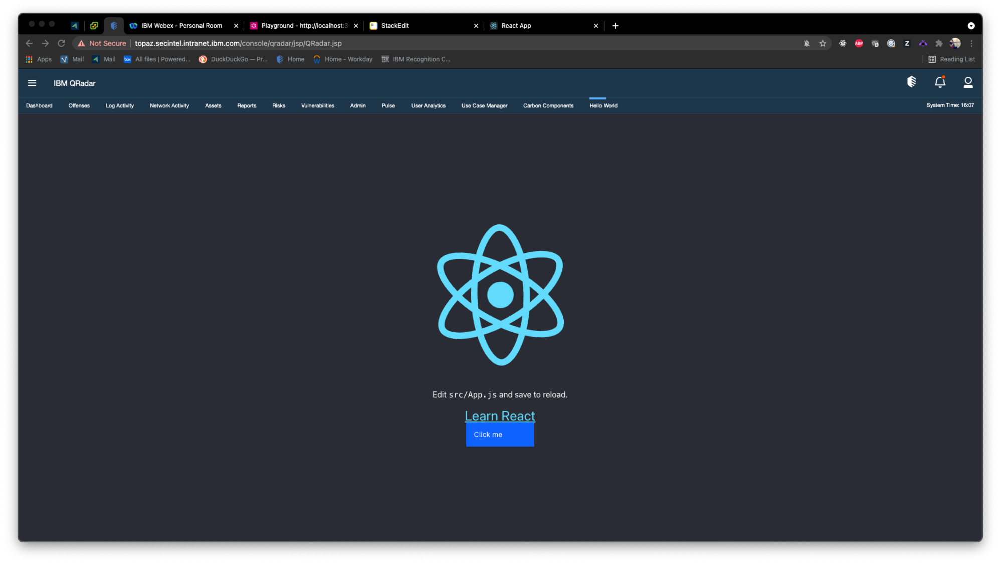

# CarbonComponents - Set-up Tutorial

This tutorial walks through how to create an application using v2 of the QRadar App SDK, React, and Carbon components. It is a companion to the full CarbonComponents sample to more fully explain how to set up a project with this structure. 

These steps aren't required to run the CarbonComponents sample app out of the box; see the [README](../README.md) of the app for how to run it. 

## Objectives

By the end of this tutorial, you should have a basic React application with one Carbon Component. A production build of this React application will be served by a Flask webserver that was generated using the QRadar App SDK. The tutorial will also explain how to package and deploy the application to a QRadar console.

## Pre-requisites
-  [Python 3](https://www.python.org/downloads/) and [pip](https://pip.pypa.io/en/stable/installing/) - To download required Python modules.
-  [Docker](https://docs.docker.com/get-docker/) - To download required Red Hat RPMs.
-  [QRadar App SDK v2](https://exchange.xforce.ibmcloud.com/hub/extension/517ff786d70b6dfa39dde485af6cbc8b) - To run apps locally and to deploy to a QRadar system.
-  [Node >= 10.16 and npm >= 5.6](https://nodejs.org/en/) - To generate the React app used for the front end.

**IMPORTANT:** to deploy a v2 application to your QRadar console, you MUST be on one of the following versions of QRadar:
- 7.3.3 fix pack 6+
- 7.4.1 fix pack 2+
- 7.4.2+

## Step 1: Creating the QRadar application

The SDK comes with a command to autogenerate a Flask application that can be deployed to QRadar out of the box. First we will create one of these apps.

Create a new directory for your application to live in. Then in that directory run the following command:

```bash
qapp create
```

These generated apps can be run locally inside a docker container. Run the following command to both build a docker image for your app and start a container using that image:

```bash
qapp run
```

Copy the localhost link output to the terminal and open it in a browser. You should see a page with the words "Hello, World!".



## Step 2: Creating the React application

We'll be using [Create React App](https://create-react-app.dev/) to generate the React application that will serve as the front end of this app. Still in the root directory, run the following command:

```bash
npx create-react-app react-app
```

_Note: `npx` is not a typo, it's a package runner tool that comes with npm 5.2+._

It will take a minute or two to generate the React app and install all the necessary dependencies, When it's finished all the application code can be found in a new `react-app` directory.

To launch the application locally, navigate into the `react-app` directory and run the following command:

```bash
yarn start
```

The application will start up on localhost:3000.



## Step 3: Installing front-end dependencies

Next we'll install all the necessary dependencies for the React app.

There are quite a few different packages that make up Carbon, and you can add or remove them as you need them. We'll add the following packages to start off with:

1.  `carbon-components-react` - A collection of Carbon components built in React;
2.  `@carbon/ibm-security` - An extension of Carbon that includes more components commonly used by offerings in the IBM Security organisation;
3.  `@carbon/colors` - The predefined colour schemes used by Carbon;
4.  `@carbon/icons-react` - A set of Carbon icons that can be imported and used as React components;

Install all of these by running the following command in the `react-app` directory:

```bash
yarn add carbon-components-react @carbon/ibm-security @carbon/colors @carbon/icons-react
```

All of the Carbon components are styled using SCSS, so we'll also need to bring in the `node-sass` package to support that:

```bash
yarn add node-sass
```

Finally, we'll also install `axios`, a promise based HTTP client that will be used in the front-end to make requests for data from the Flask webserver:

```bash
yarn add axios
```

## Step 4: Convert existing CSS files to SCSS

Before going any further, we should confirm that SCSS has been installed correctly and that the React application still works as expected.

The React app should only have two CSS files at this stage: `src/App.css` and `src/index.css`. To convert these files to SCSS, simply update the file extensions to `.scss` instead.

Remember to update the import statements in `src/App.js` and `src/index.js` to match the new names of the files:

```js
/* in App.js */
import  './App.scss'
```
```js
/* in index.js */
import  './index.scss'
```

Refresh/restart the React application and confirm it still loads as expected.

## Step 5: Getting Flask to serve the React app

As mentioned at the beginning of this guide, the end goal is to have a Flask application that serves a production build of a React application that we can deploy to QRadar. To achieve this, we need to be able to customise the build process to ensure that the resultant files can be found by QRadar once the app is deployed.

Create React App hides most of the configuration files that dictate where the application is built to. We can get access to these files by [ejecting](https://create-react-app.dev/docs/available-scripts#npm-run-eject) the React application.

#### Justification for ejecting

Ejecting a Create React App application is often encouraged against, as it's a one-way operation that exposes a lot that's going on behind the scenes of the relatively simply app that was generated. However, once we have access to the hidden configuration files, we can specify exactly where the app should be built to, as well as what the paths for the minified js and css files will be. This is important as we need to make sure that, once our application is deployed to QRadar, these files are being served from a place that QRadar can find.

#### Running the eject command

To eject the React app, run the following command:

```bash
yarn eject
```

Once this process has finished, you'll notice a new `config` folder in the root directory of the React app. It's the files in this folder that we need to update to ensure that the production build of the React app will cooperate with QRadar once it's deployed.

There are a few updates to make, let's go through them step by step:

1. In `react-app/config/paths.js`, there is a `buildPath` variable that dictates where the production build ends up. The build will need to be somewhere in the `app` directory of the project, so that it gets included in the package that gets deployed to QRadar. Update this variable to the following:

```js
const  buildPath = '../app/static/react';
```

2. Open `webpack.config.js`, found in the `config` directory. Among other things, this file dictates the names of the minified css and js files that are generated as part of the build process. By default, these names are prefaced with `static/`. We need to update this, otherwise our files will be written to `app/static/react/static`. Do a find and replace for `static/` and remove it from all filepaths, e.g.

```js
/* before */
filename:  isEnvProduction
	? 'static/js/[name].[contenthash:8].js'
	: isEnvDevelopment && 'static/js/bundle.js',

/* after */
filename:  isEnvProduction
	? 'js/[name].[contenthash:8].js'
	: isEnvDevelopment && 'js/bundle.js',
```

3. Still in `webpack.config.js`, find where the `HtmlWebpackPlugin` object is initialised. Here we're going to add a `filename` field to specify that the compiled `index.html` file should be written to the templates directory of the Flask app:
```js
new  HtmlWebpackPlugin(
	Object.assign(
		{},
		{
			inject:  true,
			template:  paths.appHtml,
			filename:  "../../templates/index.html",
		},
		/* some additional code that doesn't need updated */
	)
);
```

4. In the `package.json` of the React app, add a `homepage` field and set it equal to `./static/react`. This is important as by default Create React App produces a build assuming that the app will be hosted at the server root.
```json
"homepage": "./static/react",
```

#### Building the React app
Do a production build of the React application by running the following command in the `react-app` directory:
```bash
yarn build
```
Once that completes, you should notice that a new `react` directory has been created in  `app/static` that contains all of the resultant build files. There should also be a new `index.html` file in the `app/templates` directory.

#### Updating the Flask app
Now that the React app has been built to the correct location, we need to update the Flask app to ensure it serves the build.

Open `views.py` and replace its contents with the following:

```py
from flask import Blueprint, render_template

# pylint: disable=invalid-name
viewsbp = Blueprint('viewsbp', __name__, url_prefix='/')

@viewsbp.route('/')
@viewsbp.route('/index')
def  index():
	return render_template('index.html')
```

This will serve the `index.html` file that was produced by the React build.

Delete the `hello.py` template file that was previously being served as it's no longer needed.

#### Moment of truth

Run the following commands from the root of the application to clean up the existing docker container and image for the application and spin up new ones:

```bash
qapp clean -i
qapp run
```

Navigate to the localhost url that is output in the terminal. If everything is set up correctly, you should see the same React page as before in Step 2, but now it's being served by Flask.

## Step 6: Bringing in Carbon Components

Now that the hard part is over, we can concentrate on bringing some Carbon components into our app. For the purposes of this tutorial, we're just going to bring in the one component to confirm that everything is imported and working as expected. The full sample application demonstrates how to import and use around 10 different Carbon components; refer to that for some more examples.

The Carbon component we're going to use is the [Button](https://react.carbondesignsystem.com/?path=/story/components-button--default) component. We'll add the button at the bottom of the page that's currently being served by the Flask app.

Open `App.js` and update it with the following:

```js
import { Button } from  '@carbon/ibm-security';
import  logo  from  './logo.svg';
import  './App.scss';

function  App() {
	return (
		<div  className="App">
			<header  className="App-header">
				
				<p>
					Edit <code>src/App.js</code> and save to reload.
				</p>
				<a
					className="App-link"
					href="https://reactjs.org"
					target="_blank"
					rel="noopener noreferrer"
				>
					Learn React
				</a>
				<Button>Click me</Button>
			</header>
		</div>
	);
}
export default App;
```

Note that we've imported the Button at the top of the file, and then called it in the render function.

To see these changes, we'll need to do a fresh production build of the React app for the Flask app to serve. Run the commands below:

```bash
cd react-app && yarn build
cd ..
qapp clean -i
qapp run
```
Navigate to the localhost link that is output in the terminal, and you'll notice that, even though a button has appeared underneath the "Learn React" link, it doesn't look like a Carbon Button. 



We still need to import the Carbon SCSS so that our components will show up as expected.

Open `index.scss` and add the following line at the top of the file:

```scss
@import  '@carbon/ibm-security/css/index.min.css';
```

Rebuild the React app and spin up the Docker container again, and you should now see the Button with the Carbon styling applied.



## Step 7: Deploying to QRadar

In order to deploy our application to a QRadar console instance, we must first package it into an appropriate format. QRadar application packages must contain the following 3 things:

1. An `app` folder;
2. A `container` folder;
3. A `manifest.json` file.

So we could just compress the root folder of our application and deploy the whole thing. However, we want to keep the package as slim as possible to help with performance and deployment times. Because the Flask server serves a production build of the React app, there's no need to include the source code or any of its dependencies. Thanks to the changes we made when ejecting the React app in Step 5, everything we need has already been compiled into `app/static/react`.

From the root directory of the application, run the commands below to generate a fresh build of the React app and compress only the essential files into an `app.zip` package.

```bash
cd react-app && yarn build
cd ..
zip app.zip -r app container manifest.json
```

Once the package file has been created, use the following command to deploy it:

```bash
qapp deploy -p app.zip -q <qradar console ip> -u <qradar user>
```

If this is your first time deploying to this QRadar system, you'll be asked if you'd like to download a CA certificate bundle. This is one-time download per system and is used for authentication. Say yes, answer the following prompts according to your own QRadar set up, and wait for the application to be created. 

When it's finished, refresh your QRadar console and you should notice a new tab called "Hello World" has appeared.



Click on this tab and you should see the React page.


